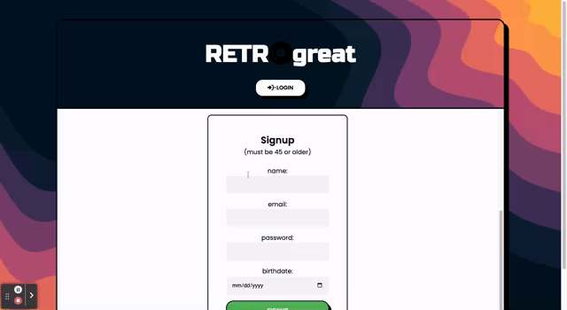
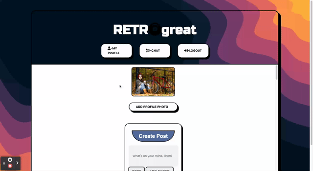

Retro Great is the ultimate social media app designed specifically for Gen Xers to relive the good old days and share their experiences with like-minded individuals. Whether it's discussing nostalgic topics or sharing tips on home improvement projects, Retro Great is the perfect platform to connect with others who share your passions.

One of the unique features of Retro Great is the age group post filter, which allows you to customize your feed based on your preferred age group. Retro Great also includes an open chat room, where you can connect with other users and chat about anything. Overall, Retro Great provides an all-in-one experience for Gen Xers.

### Usage
To add a photo or a status update, it's easy! Simply click on your profile page and you will be prompted to add a status or photo. Your post will be visible on your own profile and on the homepage feed. To comment on a post, click on the post you want to comment on and the comment section will appear. You can update or delete your post by clicking on it and selecting the appropriate button.

To join a chat room, click on "Chat" in the header and you will be directed there. Finally, an age filter is available on the homepage at the top of the screen. Click on the arrow icon to filter your feed and see content from your desired age group.

### Contributors 

### Links
See it live on [Heroku!](https://retro-great-1.herokuapp.com/)

### Images Credits
The contributors of this project do not own the photos in seed post data file. The rights remain with the creators all found on [shutterstock.com](https://www.shutterstock.com/discover/stock-image-0120?ds_ag=FF%3DBrand-Shutter-Stock-Image_AU%3DProspecting&ds_agid=58700002396912626&ds_cid=71700000014879517&ds_eid=700000001400310&ds_rl=1243391&gclid=CjwKCAjw5pShBhB_EiwAvmnNV_60_4IRx4qAMjf6F6dsCGTetBFij1WQ3wWziNOvRDfeFz-OXGa2rhoCmZ8QAvD_BwE&gclsrc=aw.ds&kw=shutter%20stock%20image&utm_campaign=CO%3DUS_LG%3DEN_BU%3DIMG_AD%3DBRAND_TS%3Dlggeneric_RG%3DAMER_AB%3DACQ_CH%3DSEM_OG%3DCONV_PB%3DGoogle&utm_medium=cpc&utm_source=GOOGLE). 

### Project Status
The production for this project has slowed down. Our future development goals include:

- Add chat rooms
- Add ability to post from the public feed page
- Add video upload capability
- Fix multiple picture upload issue
- Add ability to replace and/or add pictures on posts 
- Add pages for special interests
- Add profile bio section
- Add user account management

### Questions?
For any comments, questions or concerns you can contact us here on github!
